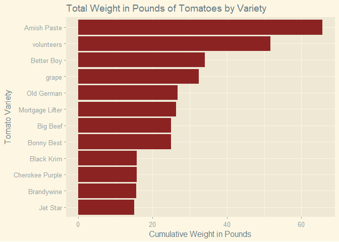

```r
library(tidyverse)     # for graphing and data cleaning
library(gardenR)       # for Lisa's garden data
library(lubridate)     # for date manipulation
library(ggthemes)      # for even more plotting themes
library(geofacet)      # for special faceting with US map layout
theme_set(theme_minimal())       # My favorite ggplot() theme :)
```


```r
# Lisa's garden data
data("garden_harvest")

# Seeds/plants (and other garden supply) costs
data("garden_spending")

# Planting dates and locations
data("garden_planting")

# Tidy Tuesday data
kids <- readr::read_csv('https://raw.githubusercontent.com/rfordatascience/tidytuesday/master/data/2020/2020-09-15/kids.csv')
```

## Setting up on GitHub!

Before starting your assignment, you need to get yourself set up on GitHub and make sure GitHub is connected to R Studio. To do that, you should read the instruction (through the "Cloning a repo" section) and watch the video [here](https://github.com/llendway/github_for_collaboration/blob/master/github_for_collaboration.md). Then, do the following (if you get stuck on a step, don't worry, I will help! You can always get started on the homework and we can figure out the GitHub piece later):

* Create a repository on GitHub, giving it a nice name so you know it is for the 3rd weekly exercise assignment (follow the instructions in the document/video).  
* Copy the repo name so you can clone it to your computer. In R Studio, go to file --> New project --> Version control --> Git and follow the instructions from the document/video.  
* Download the code from this document and save it in the repository folder/project on your computer.  
* In R Studio, you should then see the .Rmd file in the upper right corner in the Git tab (along with the .Rproj file and probably .gitignore).  
* Check all the boxes of the files in the Git tab and choose commit.  
* In the commit window, write a commit message, something like "Initial upload" would be appropriate, and commit the files.  
* Either click the green up arrow in the commit window or close the commit window and click the green up arrow in the Git tab to push your changes to GitHub.  
* Refresh your GitHub page (online) and make sure the new documents have been pushed out.  
* Back in R Studio, knit the .Rmd file. When you do that, you should have two (as long as you didn't make any changes to the .Rmd file, in which case you might have three) files show up in the Git tab - an .html file and an .md file. The .md file is something we haven't seen before and is here because I included `keep_md: TRUE` in the YAML heading. The .md file is a markdown (NOT R Markdown) file that is an interim step to creating the html file. They are displayed fairly nicely in GitHub, so we want to keep it and look at it there. Click the boxes next to these two files, commit changes (remember to include a commit message), and push them (green up arrow).  
* As you work through your homework, save and commit often, push changes occasionally (maybe after you feel finished with an exercise?), and go check to see what the .md file looks like on GitHub.  
* If you have issues, let me know! This is new to many of you and may not be intuitive at first. But, I promise, you'll get the hang of it! 


## Instructions

* Put your name at the top of the document. 

* **For ALL graphs, you should include appropriate labels.** 

* Feel free to change the default theme, which I currently have set to `theme_minimal()`. 

* Use good coding practice. Read the short sections on good code with [pipes](https://style.tidyverse.org/pipes.html) and [ggplot2](https://style.tidyverse.org/ggplot2.html). **This is part of your grade!**

* When you are finished with ALL the exercises, uncomment the options at the top so your document looks nicer. Don't do it before then, or else you might miss some important warnings and messages.


## Warm-up exercises with garden data

These exercises will reiterate what you learned in the "Expanding the data wrangling toolkit" tutorial. If you haven't gone through the tutorial yet, you should do that first.

  1. Summarize the `garden_harvest` data to find the total harvest weight in pounds for each vegetable and day of week (HINT: use the `wday()` function from `lubridate`). Display the results so that the vegetables are rows but the days of the week are columns.


```r
garden_harvest %>% 
  mutate(day_of_week = wday(date, label = TRUE)) %>% 
  group_by(vegetable, day_of_week) %>% 
  summarize(pounds = sum((weight * 0.00220462))) %>% 
  arrange(day_of_week) %>% 
  arrange(vegetable) %>% 
  pivot_wider(names_from = day_of_week, 
              values_from = pounds)
```

<div data-pagedtable="false">
  <script data-pagedtable-source type="application/json">
{"columns":[{"label":["vegetable"],"name":[1],"type":["chr"],"align":["left"]},{"label":["Sat"],"name":[2],"type":["dbl"],"align":["right"]},{"label":["Mon"],"name":[3],"type":["dbl"],"align":["right"]},{"label":["Tue"],"name":[4],"type":["dbl"],"align":["right"]},{"label":["Thu"],"name":[5],"type":["dbl"],"align":["right"]},{"label":["Fri"],"name":[6],"type":["dbl"],"align":["right"]},{"label":["Sun"],"name":[7],"type":["dbl"],"align":["right"]},{"label":["Wed"],"name":[8],"type":["dbl"],"align":["right"]}],"data":[{"1":"apple","2":"0.34392072","3":"NA","4":"NA","5":"NA","6":"NA","7":"NA","8":"NA"},{"1":"asparagus","2":"0.04409240","3":"NA","4":"NA","5":"NA","6":"NA","7":"NA","8":"NA"},{"1":"basil","2":"0.41005932","3":"0.0661386","4":"0.11023100","5":"0.02645544","6":"0.46737944","7":"NA","8":"NA"},{"1":"beans","2":"4.70906832","3":"6.5080382","4":"4.38719380","5":"3.39291018","6":"1.52559704","7":"1.91361016","8":"4.08295624"},{"1":"beets","2":"0.37919464","3":"0.6724091","4":"0.15873264","5":"11.89172028","6":"0.02425082","7":"0.32187452","8":"0.18298346"},{"1":"broccoli","2":"NA","3":"0.8201186","4":"NA","5":"NA","6":"0.16534650","7":"1.25883802","8":"0.70768302"},{"1":"carrots","2":"2.33028334","3":"0.8708249","4":"0.35273920","5":"2.67420406","6":"2.13848140","7":"2.93655384","8":"5.56225626"},{"1":"chives","2":"NA","3":"NA","4":"NA","5":"NA","6":"NA","7":"NA","8":"0.01763696"},{"1":"cilantro","2":"0.03747854","3":"NA","4":"0.00440924","5":"NA","6":"0.07275246","7":"NA","8":"NA"},{"1":"corn","2":"1.31615814","3":"0.7583893","4":"0.72752460","5":"NA","6":"3.44802568","7":"1.45725382","8":"5.30211110"},{"1":"cucumbers","2":"9.64080326","3":"4.7752069","4":"10.04645334","5":"3.30693000","6":"7.42956940","7":"3.10410496","8":"5.30652034"},{"1":"edamame","2":"4.68922674","3":"NA","4":"1.40213832","5":"NA","6":"NA","7":"NA","8":"NA"},{"1":"hot peppers","2":"NA","3":"1.2588380","4":"0.14109568","5":"NA","6":"NA","7":"NA","8":"0.06834322"},{"1":"jalapeño","2":"1.50796008","3":"5.5534378","4":"0.54895038","5":"0.22487124","6":"1.29411194","7":"0.26234978","8":"0.48060716"},{"1":"kale","2":"1.49032312","3":"2.0679336","4":"0.28219136","5":"0.27998674","6":"0.38139926","7":"0.82673250","8":"0.61729360"},{"1":"kohlrabi","2":"NA","3":"NA","4":"NA","5":"0.42108242","6":"NA","7":"NA","8":"NA"},{"1":"lettuce","2":"1.31615814","3":"2.4581513","4":"0.91712192","5":"2.45153744","6":"1.80117454","7":"1.46607230","8":"1.18608556"},{"1":"onions","2":"1.91361016","3":"0.5092672","4":"0.70768302","5":"0.60186126","6":"0.07275246","7":"0.26014516","8":"NA"},{"1":"peas","2":"2.85277828","3":"4.6341112","4":"2.06793356","5":"3.39731942","6":"0.93696350","7":"2.05691046","8":"1.08026380"},{"1":"peppers","2":"1.38229674","3":"2.5264945","4":"1.44402610","5":"0.70988764","6":"0.33510224","7":"0.50265336","8":"2.44271896"},{"1":"potatoes","2":"2.80207202","3":"0.9700328","4":"NA","5":"11.85203712","6":"3.74124014","7":"NA","8":"4.57017726"},{"1":"pumpkins","2":"92.68883866","3":"30.1195184","4":"31.85675900","5":"NA","6":"NA","7":"NA","8":"NA"},{"1":"radish","2":"0.23148510","3":"0.1962112","4":"0.09479866","5":"0.14770954","6":"0.19400656","7":"0.08157094","8":"NA"},{"1":"raspberries","2":"0.53351804","3":"0.1300726","4":"0.33510224","5":"0.28880522","6":"0.57099658","7":"NA","8":"NA"},{"1":"rutabaga","2":"6.89825598","3":"NA","4":"NA","5":"NA","6":"3.57809826","7":"19.26396956","8":"NA"},{"1":"spinach","2":"0.26014516","3":"0.1477095","4":"0.49603950","5":"0.23368972","6":"0.19621118","7":"0.48722102","8":"0.21384814"},{"1":"squash","2":"56.22221924","3":"24.3345956","4":"18.46810174","5":"NA","6":"NA","7":"NA","8":"NA"},{"1":"strawberries","2":"0.16975574","3":"0.4784025","4":"NA","5":"0.08818480","6":"0.48722102","7":"0.08157094","8":"NA"},{"1":"Swiss chard","2":"0.73413846","3":"1.0736499","4":"0.07054784","5":"2.23107544","6":"0.61729360","7":"1.24781492","8":"0.90830344"},{"1":"tomatoes","2":"35.12621046","3":"11.4926841","4":"48.75076206","5":"34.51773534","6":"85.07628580","7":"75.60964752","8":"58.26590198"},{"1":"zucchini","2":"3.41495638","3":"12.1959578","4":"16.46851140","5":"34.63017096","6":"18.72163304","7":"12.23564100","8":"2.04147812"}],"options":{"columns":{"min":{},"max":[10]},"rows":{"min":[10],"max":[10]},"pages":{}}}
  </script>
</div>

```r
# couldn't figure out how to get the days of the week to be in order. 
```

  2. Summarize the `garden_harvest` data to find the total harvest in pound for each vegetable variety and then try adding the plot from the `garden_planting` table. This will not turn out perfectly. What is the problem? How might you fix it?


```r
garden_harvest %>% 
  group_by(variety) %>%
  summarize(pounds = sum(weight * 0.00220462)) %>% 
  inner_join(garden_planting) 
```

<div data-pagedtable="false">
  <script data-pagedtable-source type="application/json">
{"columns":[{"label":["variety"],"name":[1],"type":["chr"],"align":["left"]},{"label":["pounds"],"name":[2],"type":["dbl"],"align":["right"]},{"label":["plot"],"name":[3],"type":["chr"],"align":["left"]},{"label":["vegetable"],"name":[4],"type":["chr"],"align":["left"]},{"label":["number_seeds_planted"],"name":[5],"type":["dbl"],"align":["right"]},{"label":["date"],"name":[6],"type":["date"],"align":["right"]},{"label":["number_seeds_exact"],"name":[7],"type":["lgl"],"align":["right"]},{"label":["notes"],"name":[8],"type":["chr"],"align":["left"]}],"data":[{"1":"Amish Paste","2":"65.6734252","3":"J","4":"tomatoes","5":"1","6":"2020-05-20","7":"TRUE","8":"NA"},{"1":"Amish Paste","2":"65.6734252","3":"N","4":"tomatoes","5":"2","6":"2020-05-20","7":"TRUE","8":"NA"},{"1":"Better Boy","2":"34.0084681","3":"J","4":"tomatoes","5":"1","6":"2020-05-20","7":"TRUE","8":"NA"},{"1":"Better Boy","2":"34.0084681","3":"N","4":"tomatoes","5":"1","6":"2020-05-20","7":"TRUE","8":"NA"},{"1":"Big Beef","2":"24.9937769","3":"N","4":"tomatoes","5":"1","6":"2020-05-20","7":"TRUE","8":"NA"},{"1":"Black Krim","2":"15.8071254","3":"N","4":"tomatoes","5":"1","6":"2020-05-20","7":"TRUE","8":"NA"},{"1":"Blue (saved)","2":"41.5240177","3":"A","4":"squash","5":"4","6":"2020-05-20","7":"TRUE","8":"NA"},{"1":"Blue (saved)","2":"41.5240177","3":"B","4":"squash","5":"8","6":"2020-05-20","7":"TRUE","8":"NA"},{"1":"Bolero","2":"8.2915758","3":"H","4":"carrots","5":"50","6":"2020-05-02","7":"FALSE","8":"NA"},{"1":"Bolero","2":"8.2915758","3":"L","4":"carrots","5":"50","6":"2020-05-25","7":"FALSE","8":"NA"},{"1":"Bonny Best","2":"24.9232291","3":"J","4":"tomatoes","5":"1","6":"2020-05-20","7":"TRUE","8":"NA"},{"1":"Brandywine","2":"15.6461881","3":"J","4":"tomatoes","5":"1","6":"2020-05-20","7":"TRUE","8":"NA"},{"1":"Bush Bush Slender","2":"22.1299756","3":"M","4":"beans","5":"30","6":"2020-05-16","7":"FALSE","8":"NA"},{"1":"Bush Bush Slender","2":"22.1299756","3":"D","4":"beans","5":"10","6":"2020-05-21","7":"TRUE","8":"NA"},{"1":"Catalina","2":"2.0348643","3":"H","4":"spinach","5":"50","6":"2020-05-16","7":"FALSE","8":"NA"},{"1":"Catalina","2":"2.0348643","3":"E","4":"spinach","5":"100","6":"2020-06-20","7":"FALSE","8":"NA"},{"1":"Cherokee Purple","2":"15.7123267","3":"J","4":"tomatoes","5":"1","6":"2020-05-20","7":"TRUE","8":"NA"},{"1":"Chinese Red Noodle","2":"0.7848447","3":"K","4":"beans","5":"5","6":"2020-05-25","7":"TRUE","8":"NA"},{"1":"Chinese Red Noodle","2":"0.7848447","3":"L","4":"beans","5":"5","6":"2020-05-25","7":"TRUE","8":"NA"},{"1":"cilantro","2":"0.1146402","3":"potD","4":"cilantro","5":"15","6":"2020-05-16","7":"FALSE","8":"NA"},{"1":"cilantro","2":"0.1146402","3":"E","4":"cilantro","5":"20","6":"2020-06-20","7":"FALSE","8":"NA"},{"1":"Cinderella's Carraige","2":"32.8730888","3":"B","4":"pumpkins","5":"3","6":"2020-05-20","7":"TRUE","8":"NA"},{"1":"Classic Slenderette","2":"3.6045537","3":"E","4":"beans","5":"29","6":"2020-06-20","7":"TRUE","8":"NA"},{"1":"Crispy Colors Duo","2":"0.4210824","3":"front","4":"kohlrabi","5":"10","6":"2020-05-20","7":"FALSE","8":"NA"},{"1":"delicata","2":"10.4984004","3":"K","4":"squash","5":"8","6":"2020-05-25","7":"TRUE","8":"NA"},{"1":"Delicious Duo","2":"0.7539800","3":"P","4":"onions","5":"25","6":"2020-04-26","7":"FALSE","8":"NA"},{"1":"Dorinny Sweet","2":"11.4067039","3":"A","4":"corn","5":"20","6":"2020-05-25","7":"FALSE","8":"NA"},{"1":"Dragon","2":"4.1050024","3":"H","4":"carrots","5":"40","6":"2020-05-02","7":"FALSE","8":"NA"},{"1":"Dragon","2":"4.1050024","3":"L","4":"carrots","5":"50","6":"2020-05-25","7":"FALSE","8":"NA"},{"1":"edamame","2":"6.0913651","3":"O","4":"edamame","5":"25","6":"2020-05-16","7":"FALSE","8":"NA"},{"1":"Farmer's Market Blend","2":"3.8029695","3":"C","4":"lettuce","5":"60","6":"2020-05-02","7":"FALSE","8":"NA"},{"1":"Farmer's Market Blend","2":"3.8029695","3":"L","4":"lettuce","5":"60","6":"2020-05-16","7":"FALSE","8":"NA"},{"1":"Garden Party Mix","2":"0.9457820","3":"C","4":"radish","5":"20","6":"2020-05-02","7":"FALSE","8":"NA"},{"1":"Garden Party Mix","2":"0.9457820","3":"G","4":"radish","5":"30","6":"2020-05-02","7":"FALSE","8":"NA"},{"1":"Garden Party Mix","2":"0.9457820","3":"H","4":"radish","5":"15","6":"2020-05-02","7":"FALSE","8":"NA"},{"1":"giant","2":"9.8722884","3":"L","4":"jalapeño","5":"4","6":"2020-05-21","7":"TRUE","8":"NA"},{"1":"Golden Bantam","2":"1.6027587","3":"B","4":"corn","5":"20","6":"2020-05-25","7":"FALSE","8":"NA"},{"1":"Gourmet Golden","2":"7.0217147","3":"H","4":"beets","5":"40","6":"2020-05-02","7":"FALSE","8":"NA"},{"1":"grape","2":"32.3946863","3":"O","4":"tomatoes","5":"1","6":"2020-05-20","7":"TRUE","8":"NA"},{"1":"green","2":"5.6923288","3":"K","4":"peppers","5":"12","6":"2020-05-21","7":"TRUE","8":"NA"},{"1":"green","2":"5.6923288","3":"O","4":"peppers","5":"5","6":"2020-05-21","7":"TRUE","8":"NA"},{"1":"Heirloom Lacinto","2":"5.9458601","3":"P","4":"kale","5":"30","6":"2020-05-02","7":"FALSE","8":"NA"},{"1":"Heirloom Lacinto","2":"5.9458601","3":"front","4":"kale","5":"30","6":"2020-06-20","7":"FALSE","8":"NA"},{"1":"Improved Helenor","2":"29.7403238","3":"E","4":"rudabaga","5":"30","6":"2020-05-25","7":"FALSE","8":"NA"},{"1":"Isle of Naxos","2":"1.0802638","3":"potB","4":"basil","5":"40","6":"2020-05-16","7":"FALSE","8":"NA"},{"1":"Jet Star","2":"15.0244853","3":"N","4":"tomatoes","5":"1","6":"2020-05-20","7":"TRUE","8":"NA"},{"1":"King Midas","2":"4.0961840","3":"H","4":"carrots","5":"50","6":"2020-05-02","7":"FALSE","8":"NA"},{"1":"King Midas","2":"4.0961840","3":"L","4":"carrots","5":"50","6":"2020-05-25","7":"FALSE","8":"NA"},{"1":"Lettuce Mixture","2":"4.7487515","3":"G","4":"lettuce","5":"200","6":"2020-06-20","7":"FALSE","8":"NA"},{"1":"Long Keeping Rainbow","2":"3.3113392","3":"H","4":"onions","5":"40","6":"2020-04-26","7":"FALSE","8":"NA"},{"1":"Magnolia Blossom","2":"7.4582295","3":"B","4":"peas","5":"24","6":"2020-04-19","7":"TRUE","8":"NA"},{"1":"Main Crop Bravado","2":"2.1318675","3":"D","4":"broccoli","5":"7","6":"2020-05-22","7":"TRUE","8":"NA"},{"1":"Main Crop Bravado","2":"2.1318675","3":"I","4":"broccoli","5":"7","6":"2020-05-22","7":"TRUE","8":"NA"},{"1":"Mortgage Lifter","2":"26.3253674","3":"J","4":"tomatoes","5":"1","6":"2020-05-20","7":"TRUE","8":"died"},{"1":"Mortgage Lifter","2":"26.3253674","3":"N","4":"tomatoes","5":"1","6":"2020-05-20","7":"TRUE","8":"NA"},{"1":"Neon Glow","2":"6.8828236","3":"M","4":"Swiss chard","5":"25","6":"2020-05-02","7":"FALSE","8":"NA"},{"1":"New England Sugar","2":"44.8596078","3":"K","4":"pumpkins","5":"4","6":"2020-05-25","7":"TRUE","8":"NA"},{"1":"Old German","2":"26.7177898","3":"J","4":"tomatoes","5":"1","6":"2020-05-20","7":"TRUE","8":"NA"},{"1":"pickling","2":"43.6095882","3":"L","4":"cucumbers","5":"20","6":"2020-05-25","7":"FALSE","8":"NA"},{"1":"purple","2":"3.0093063","3":"D","4":"potatoes","5":"5","6":"2020-05-02","7":"FALSE","8":"NA"},{"1":"red","2":"4.4334908","3":"I","4":"potatoes","5":"3","6":"2020-05-22","7":"FALSE","8":"NA"},{"1":"Red Kuri","2":"22.7318368","3":"A","4":"squash","5":"4","6":"2020-05-20","7":"TRUE","8":"NA"},{"1":"Red Kuri","2":"22.7318368","3":"B","4":"squash","5":"4","6":"2020-05-20","7":"TRUE","8":"NA"},{"1":"Red Kuri","2":"22.7318368","3":"side","4":"squash","5":"1","6":"2020-05-20","7":"TRUE","8":"NA"},{"1":"Romanesco","2":"99.7083487","3":"D","4":"zucchini","5":"3","6":"2020-05-21","7":"TRUE","8":"NA"},{"1":"Russet","2":"9.0918529","3":"D","4":"potatoes","5":"8","6":"2020-05-02","7":"FALSE","8":"NA"},{"1":"saved","2":"76.9324195","3":"B","4":"pumpkins","5":"8","6":"2020-05-20","7":"TRUE","8":"NA"},{"1":"Super Sugar Snap","2":"9.5680508","3":"A","4":"peas","5":"22","6":"2020-04-19","7":"TRUE","8":"NA"},{"1":"Sweet Merlin","2":"6.3867841","3":"H","4":"beets","5":"40","6":"2020-05-02","7":"FALSE","8":"NA"},{"1":"Tatsoi","2":"2.8946661","3":"P","4":"lettuce","5":"25","6":"2020-05-02","7":"FALSE","8":"NA"},{"1":"thai","2":"0.1477095","3":"potB","4":"hot peppers","5":"1","6":"2020-05-21","7":"TRUE","8":"NA"},{"1":"variety","2":"4.9714181","3":"potA","4":"peppers","5":"3","6":"2020-05-21","7":"TRUE","8":"NA"},{"1":"variety","2":"4.9714181","3":"potA","4":"peppers","5":"3","6":"2020-05-21","7":"TRUE","8":"NA"},{"1":"variety","2":"4.9714181","3":"potC","4":"hot peppers","5":"6","6":"2020-05-21","7":"TRUE","8":"NA"},{"1":"variety","2":"4.9714181","3":"potD","4":"peppers","5":"1","6":"2020-05-21","7":"TRUE","8":"NA"},{"1":"volunteers","2":"51.6123588","3":"N","4":"tomatoes","5":"1","6":"2020-06-03","7":"TRUE","8":"NA"},{"1":"volunteers","2":"51.6123588","3":"J","4":"tomatoes","5":"1","6":"2020-06-03","7":"TRUE","8":"NA"},{"1":"volunteers","2":"51.6123588","3":"front","4":"tomatoes","5":"5","6":"2020-06-03","7":"TRUE","8":"NA"},{"1":"volunteers","2":"51.6123588","3":"O","4":"tomatoes","5":"2","6":"2020-06-03","7":"TRUE","8":"NA"},{"1":"Waltham Butternut","2":"24.2706616","3":"A","4":"squash","5":"4","6":"2020-05-20","7":"TRUE","8":"NA"},{"1":"Waltham Butternut","2":"24.2706616","3":"K","4":"squash","5":"6","6":"2020-05-25","7":"TRUE","8":"NA"},{"1":"yellow","2":"7.4009093","3":"I","4":"potatoes","5":"10","6":"2020-05-02","7":"FALSE","8":"NA"},{"1":"yellow","2":"7.4009093","3":"I","4":"potatoes","5":"8","6":"2020-05-22","7":"TRUE","8":"NA"},{"1":"Yod Fah","2":"0.8201186","3":"P","4":"broccoli","5":"25","6":"2020-05-16","7":"FALSE","8":"NA"}],"options":{"columns":{"min":{},"max":[10]},"rows":{"min":[10],"max":[10]},"pages":{}}}
  </script>
</div>

```r
#Problems: some of the variety ones are repeated (i.e Amish Paste is listed twice with the same values for pounds and vegetable) because there wasn't a distinction made between the variety in the first plot (garden_harvest) and the second table that it was joined with; I would use the distinct function to fix this in the future. Differences in plot aren't able to be accounted for with the joined tables (i.e Amish Paste being plot J and N). 
# not all of the variables for either plot line up/match ; some are multiple (i.e variety and vegetable have two sections for each separate original table)
  
  # I had initially used the "left_join" instead of "semi-join." I like the latter better because it allows the two categories that the two tables have in common to be collapsed into one. However, some of the other variables-- such as plot, number of seeds planted, and number of seeds (exact)-- do not appear in this table as a result. As a result, I switched to inner join finally. 
```

  3. I would like to understand how much money I "saved" by gardening, for each vegetable type. Describe how I could use the `garden_harvest` and `garden_spending` datasets, along with data from somewhere like [this](https://products.wholefoodsmarket.com/search?sort=relevance&store=10542) to answer this question. You can answer this in words, referencing various join functions. You don't need R code but could provide some if it's helpful.

*First, you want to create a new variable in garden_spending that adds together the price of the seeds and their tax rates by using the mutate function. From there, you can summarize the total price for each variety of vegetable seed that was planted and calculate the total amount of money spent for each vegetable. From there, you could use the data from your new variable "pounds" in garden_harvest which calculates how many pounds of each variety you harvested. After calculating this, you can go to a website-- like the Wholefoods website-- and see how much money each variety of vegetable is per pound. Using that information, you can multiply the number of pounds by the price per pound per each variety and that number will be the amount of money saved*

  4. Subset the data to tomatoes. Reorder the tomato varieties from smallest to largest first harvest date. Create a barplot of total harvest in pounds for each variety, in the new order.


```r
garden_harvest %>% 
  filter(vegetable == "tomatoes") %>% 
  group_by(variety) %>% 
  summarize(pounds = sum(weight * 0.00220462), 
            harvest1 = min(date)) %>%
  ggplot(aes(x = pounds, 
             y = fct_reorder(variety, pounds))) +
  geom_bar(stat = "identity", 
           fill = "brown4") +
  labs(title = "Total Weight in Pounds of Tomatoes by Variety", 
       x = "Cumulative Weight in Pounds", 
       y = "Tomato Variety") + 
  theme_solarized_2()
```

<!-- -->

  5. In the `garden_harvest` data, create two new variables: one that makes the varieties lowercase and another that finds the length of the variety name. Arrange the data by vegetable and length of variety name (smallest to largest), with one row for each vegetable variety. HINT: use `str_to_lower()`, `str_length()`, and `distinct()`.
  

```r
garden_harvest %>% 
  mutate(lowercase = str_to_lower(variety)) %>% 
  mutate(length = str_length(variety)) %>% 
  distinct(variety, .keep_all = TRUE) %>% 
  arrange(vegetable, length)
```

<div data-pagedtable="false">
  <script data-pagedtable-source type="application/json">
{"columns":[{"label":["vegetable"],"name":[1],"type":["chr"],"align":["left"]},{"label":["variety"],"name":[2],"type":["chr"],"align":["left"]},{"label":["date"],"name":[3],"type":["date"],"align":["right"]},{"label":["weight"],"name":[4],"type":["dbl"],"align":["right"]},{"label":["units"],"name":[5],"type":["chr"],"align":["left"]},{"label":["lowercase"],"name":[6],"type":["chr"],"align":["left"]},{"label":["length"],"name":[7],"type":["int"],"align":["right"]}],"data":[{"1":"apple","2":"unknown","3":"2020-09-26","4":"156","5":"grams","6":"unknown","7":"7"},{"1":"asparagus","2":"asparagus","3":"2020-06-20","4":"20","5":"grams","6":"asparagus","7":"9"},{"1":"basil","2":"Isle of Naxos","3":"2020-06-23","4":"5","5":"grams","6":"isle of naxos","7":"13"},{"1":"beans","2":"Bush Bush Slender","3":"2020-07-06","4":"235","5":"grams","6":"bush bush slender","7":"17"},{"1":"beans","2":"Chinese Red Noodle","3":"2020-08-08","4":"108","5":"grams","6":"chinese red noodle","7":"18"},{"1":"beans","2":"Classic Slenderette","3":"2020-08-05","4":"41","5":"grams","6":"classic slenderette","7":"19"},{"1":"beets","2":"leaves","3":"2020-06-11","4":"8","5":"grams","6":"leaves","7":"6"},{"1":"beets","2":"Sweet Merlin","3":"2020-07-07","4":"10","5":"grams","6":"sweet merlin","7":"12"},{"1":"beets","2":"Gourmet Golden","3":"2020-07-07","4":"62","5":"grams","6":"gourmet golden","7":"14"},{"1":"broccoli","2":"Yod Fah","3":"2020-07-27","4":"372","5":"grams","6":"yod fah","7":"7"},{"1":"broccoli","2":"Main Crop Bravado","3":"2020-09-09","4":"102","5":"grams","6":"main crop bravado","7":"17"},{"1":"carrots","2":"Dragon","3":"2020-07-24","4":"80","5":"grams","6":"dragon","7":"6"},{"1":"carrots","2":"Bolero","3":"2020-07-30","4":"116","5":"grams","6":"bolero","7":"6"},{"1":"carrots","2":"greens","3":"2020-08-29","4":"169","5":"grams","6":"greens","7":"6"},{"1":"carrots","2":"King Midas","3":"2020-07-23","4":"56","5":"grams","6":"king midas","7":"10"},{"1":"chives","2":"perrenial","3":"2020-06-17","4":"8","5":"grams","6":"perrenial","7":"9"},{"1":"cilantro","2":"cilantro","3":"2020-06-23","4":"2","5":"grams","6":"cilantro","7":"8"},{"1":"corn","2":"Dorinny Sweet","3":"2020-08-11","4":"330","5":"grams","6":"dorinny sweet","7":"13"},{"1":"corn","2":"Golden Bantam","3":"2020-08-15","4":"383","5":"grams","6":"golden bantam","7":"13"},{"1":"cucumbers","2":"pickling","3":"2020-07-08","4":"181","5":"grams","6":"pickling","7":"8"},{"1":"edamame","2":"edamame","3":"2020-08-11","4":"109","5":"grams","6":"edamame","7":"7"},{"1":"hot peppers","2":"thai","3":"2020-07-20","4":"12","5":"grams","6":"thai","7":"4"},{"1":"hot peppers","2":"variety","3":"2020-07-20","4":"559","5":"grams","6":"variety","7":"7"},{"1":"jalapeño","2":"giant","3":"2020-07-17","4":"20","5":"grams","6":"giant","7":"5"},{"1":"kale","2":"Heirloom Lacinto","3":"2020-06-13","4":"10","5":"grams","6":"heirloom lacinto","7":"16"},{"1":"kohlrabi","2":"Crispy Colors Duo","3":"2020-09-17","4":"191","5":"grams","6":"crispy colors duo","7":"17"},{"1":"lettuce","2":"reseed","3":"2020-06-06","4":"20","5":"grams","6":"reseed","7":"6"},{"1":"lettuce","2":"Tatsoi","3":"2020-06-20","4":"18","5":"grams","6":"tatsoi","7":"6"},{"1":"lettuce","2":"mustard greens","3":"2020-06-29","4":"23","5":"grams","6":"mustard greens","7":"14"},{"1":"lettuce","2":"Lettuce Mixture","3":"2020-07-22","4":"23","5":"grams","6":"lettuce mixture","7":"15"},{"1":"lettuce","2":"Farmer's Market Blend","3":"2020-06-11","4":"12","5":"grams","6":"farmer's market blend","7":"21"},{"1":"onions","2":"Delicious Duo","3":"2020-07-16","4":"50","5":"grams","6":"delicious duo","7":"13"},{"1":"onions","2":"Long Keeping Rainbow","3":"2020-07-20","4":"102","5":"grams","6":"long keeping rainbow","7":"20"},{"1":"peas","2":"Magnolia Blossom","3":"2020-06-17","4":"8","5":"grams","6":"magnolia blossom","7":"16"},{"1":"peas","2":"Super Sugar Snap","3":"2020-06-17","4":"121","5":"grams","6":"super sugar snap","7":"16"},{"1":"peppers","2":"green","3":"2020-08-04","4":"81","5":"grams","6":"green","7":"5"},{"1":"potatoes","2":"red","3":"2020-10-15","4":"1718","5":"grams","6":"red","7":"3"},{"1":"potatoes","2":"purple","3":"2020-08-06","4":"317","5":"grams","6":"purple","7":"6"},{"1":"potatoes","2":"yellow","3":"2020-08-06","4":"439","5":"grams","6":"yellow","7":"6"},{"1":"potatoes","2":"Russet","3":"2020-09-16","4":"629","5":"grams","6":"russet","7":"6"},{"1":"pumpkins","2":"saved","3":"2020-09-01","4":"4758","5":"grams","6":"saved","7":"5"},{"1":"pumpkins","2":"New England Sugar","3":"2020-09-19","4":"1109","5":"grams","6":"new england sugar","7":"17"},{"1":"pumpkins","2":"Cinderella's Carraige","3":"2020-09-01","4":"7350","5":"grams","6":"cinderella's carraige","7":"21"},{"1":"radish","2":"Garden Party Mix","3":"2020-06-06","4":"36","5":"grams","6":"garden party mix","7":"16"},{"1":"rutabaga","2":"Improved Helenor","3":"2020-10-16","4":"883","5":"grams","6":"improved helenor","7":"16"},{"1":"spinach","2":"Catalina","3":"2020-06-11","4":"9","5":"grams","6":"catalina","7":"8"},{"1":"squash","2":"delicata","3":"2020-09-19","4":"307","5":"grams","6":"delicata","7":"8"},{"1":"squash","2":"Red Kuri","3":"2020-09-19","4":"1178","5":"grams","6":"red kuri","7":"8"},{"1":"squash","2":"Blue (saved)","3":"2020-09-01","4":"3227","5":"grams","6":"blue (saved)","7":"12"},{"1":"squash","2":"Waltham Butternut","3":"2020-09-19","4":"1834","5":"grams","6":"waltham butternut","7":"17"},{"1":"Swiss chard","2":"Neon Glow","3":"2020-06-21","4":"19","5":"grams","6":"neon glow","7":"9"},{"1":"tomatoes","2":"grape","3":"2020-07-11","4":"24","5":"grams","6":"grape","7":"5"},{"1":"tomatoes","2":"Big Beef","3":"2020-07-21","4":"137","5":"grams","6":"big beef","7":"8"},{"1":"tomatoes","2":"Jet Star","3":"2020-07-28","4":"315","5":"grams","6":"jet star","7":"8"},{"1":"tomatoes","2":"Bonny Best","3":"2020-07-21","4":"339","5":"grams","6":"bonny best","7":"10"},{"1":"tomatoes","2":"Better Boy","3":"2020-07-24","4":"220","5":"grams","6":"better boy","7":"10"},{"1":"tomatoes","2":"Old German","3":"2020-07-28","4":"611","5":"grams","6":"old german","7":"10"},{"1":"tomatoes","2":"Brandywine","3":"2020-08-01","4":"320","5":"grams","6":"brandywine","7":"10"},{"1":"tomatoes","2":"Black Krim","3":"2020-08-01","4":"436","5":"grams","6":"black krim","7":"10"},{"1":"tomatoes","2":"volunteers","3":"2020-08-04","4":"73","5":"grams","6":"volunteers","7":"10"},{"1":"tomatoes","2":"Amish Paste","3":"2020-07-25","4":"463","5":"grams","6":"amish paste","7":"11"},{"1":"tomatoes","2":"Cherokee Purple","3":"2020-07-24","4":"247","5":"grams","6":"cherokee purple","7":"15"},{"1":"tomatoes","2":"Mortgage Lifter","3":"2020-07-27","4":"801","5":"grams","6":"mortgage lifter","7":"15"},{"1":"zucchini","2":"Romanesco","3":"2020-07-06","4":"175","5":"grams","6":"romanesco","7":"9"}],"options":{"columns":{"min":{},"max":[10]},"rows":{"min":[10],"max":[10]},"pages":{}}}
  </script>
</div>

```r
#not sure how to arrange for both veggie and length simultaneously? 
```

  6. In the `garden_harvest` data, find all distinct vegetable varieties that have "er" or "ar" in their name. HINT: `str_detect()` with an "or" statement (use the | for "or") and `distinct()`.


```r
garden_harvest %>% 
  distinct(variety) %>% 
  mutate(variety_letters = str_detect(variety, "er|ar"))
```

<div data-pagedtable="false">
  <script data-pagedtable-source type="application/json">
{"columns":[{"label":["variety"],"name":[1],"type":["chr"],"align":["left"]},{"label":["variety_letters"],"name":[2],"type":["lgl"],"align":["right"]}],"data":[{"1":"reseed","2":"FALSE"},{"1":"Garden Party Mix","2":"TRUE"},{"1":"Farmer's Market Blend","2":"TRUE"},{"1":"Catalina","2":"FALSE"},{"1":"leaves","2":"FALSE"},{"1":"Heirloom Lacinto","2":"FALSE"},{"1":"Magnolia Blossom","2":"FALSE"},{"1":"Super Sugar Snap","2":"TRUE"},{"1":"perrenial","2":"TRUE"},{"1":"Tatsoi","2":"FALSE"},{"1":"asparagus","2":"TRUE"},{"1":"Neon Glow","2":"FALSE"},{"1":"cilantro","2":"FALSE"},{"1":"Isle of Naxos","2":"FALSE"},{"1":"mustard greens","2":"TRUE"},{"1":"Romanesco","2":"FALSE"},{"1":"Bush Bush Slender","2":"TRUE"},{"1":"Gourmet Golden","2":"FALSE"},{"1":"Sweet Merlin","2":"TRUE"},{"1":"pickling","2":"FALSE"},{"1":"grape","2":"FALSE"},{"1":"Delicious Duo","2":"FALSE"},{"1":"giant","2":"FALSE"},{"1":"thai","2":"FALSE"},{"1":"variety","2":"TRUE"},{"1":"Long Keeping Rainbow","2":"FALSE"},{"1":"Big Beef","2":"FALSE"},{"1":"Bonny Best","2":"FALSE"},{"1":"Lettuce Mixture","2":"FALSE"},{"1":"King Midas","2":"FALSE"},{"1":"Cherokee Purple","2":"TRUE"},{"1":"Better Boy","2":"TRUE"},{"1":"Dragon","2":"FALSE"},{"1":"Amish Paste","2":"FALSE"},{"1":"Mortgage Lifter","2":"TRUE"},{"1":"Yod Fah","2":"FALSE"},{"1":"Old German","2":"TRUE"},{"1":"Jet Star","2":"TRUE"},{"1":"Bolero","2":"TRUE"},{"1":"Brandywine","2":"FALSE"},{"1":"Black Krim","2":"FALSE"},{"1":"volunteers","2":"TRUE"},{"1":"green","2":"FALSE"},{"1":"Classic Slenderette","2":"TRUE"},{"1":"purple","2":"FALSE"},{"1":"yellow","2":"FALSE"},{"1":"Chinese Red Noodle","2":"FALSE"},{"1":"edamame","2":"FALSE"},{"1":"Dorinny Sweet","2":"FALSE"},{"1":"Golden Bantam","2":"FALSE"},{"1":"greens","2":"FALSE"},{"1":"saved","2":"FALSE"},{"1":"Blue (saved)","2":"FALSE"},{"1":"Cinderella's Carraige","2":"TRUE"},{"1":"Main Crop Bravado","2":"FALSE"},{"1":"Russet","2":"FALSE"},{"1":"Crispy Colors Duo","2":"FALSE"},{"1":"delicata","2":"FALSE"},{"1":"Waltham Butternut","2":"TRUE"},{"1":"Red Kuri","2":"FALSE"},{"1":"New England Sugar","2":"TRUE"},{"1":"unknown","2":"FALSE"},{"1":"red","2":"FALSE"},{"1":"Improved Helenor","2":"FALSE"}],"options":{"columns":{"min":{},"max":[10]},"rows":{"min":[10],"max":[10]},"pages":{}}}
  </script>
</div>


## Bicycle-Use Patterns

In this activity, you'll examine some factors that may influence the use of bicycles in a bike-renting program.  The data come from Washington, DC and cover the last quarter of 2014.

<center>


```r
#{300px}

#{300px}
```


</center>

Two data tables are available:

- `Trips` contains records of individual rentals
- `Stations` gives the locations of the bike rental stations

Here is the code to read in the data. We do this a little differently than usualy, which is why it is included here rather than at the top of this file. To avoid repeatedly re-reading the files, start the data import chunk with `{r cache = TRUE}` rather than the usual `{r}`.


```r
data_site <- 
  "https://www.macalester.edu/~dshuman1/data/112/2014-Q4-Trips-History-Data-Small.rds" 
Trips <- readRDS(gzcon(url(data_site)))
```

```
## Error in readRDS(gzcon(url(data_site))): cannot open the connection
```

```r
Stations<-read_csv("http://www.macalester.edu/~dshuman1/data/112/DC-Stations.csv")
```

```
## Error in open.connection(con, "rb"): Send failure: Connection was reset
```

**NOTE:** The `Trips` data table is a random subset of 10,000 trips from the full quarterly data. Start with this small data table to develop your analysis commands. **When you have this working well, you should access the full data set of more than 600,000 events by removing `-Small` from the name of the `data_site`.**

### Temporal patterns

It's natural to expect that bikes are rented more at some times of day, some days of the week, some months of the year than others. The variable `sdate` gives the time (including the date) that the rental started. Make the following plots and interpret them:

  7. A density plot, which is a smoothed out histogram, of the events versus `sdate`. Use `geom_density()`.
  

```r
Trips %>% 
  ggplot() +
  geom_density(aes(x = sdate), color = "dodgerblue4", fill = "powderblue") +
  labs(x = "Date (Months)", y = " ", title = "Density of Number of Trips over Time (Months)")
```

```
## Error in ggplot(.): object 'Trips' not found
```
  
  8. A density plot of the events versus time of day.  You can use `mutate()` with `lubridate`'s  `hour()` and `minute()` functions to extract the hour of the day and minute within the hour from `sdate`. Hint: A minute is 1/60 of an hour, so create a variable where 3:30 is 3.5 and 3:45 is 3.75.
  

```r
Trips %>% 
  mutate(sdate_hour = hour(sdate) + minute(sdate)/60) %>% 
  ggplot() +
  geom_density(aes(x = sdate_hour), color = "dodgerblue4", fill = "powderblue") +
  labs(x = "Time in Hours", y = "", title = "Density of Trip Times in Hours")
```

```
## Error in mutate(., sdate_hour = hour(sdate) + minute(sdate)/60): object 'Trips' not found
```
  
  9. A bar graph of the events versus day of the week. Put day on the y-axis.
  

```r
Trips %>% 
  mutate(day_of_week = wday(sdate, label = TRUE)) %>%
  ggplot() +
  geom_bar(aes(y = day_of_week), fill = "powderblue") +
  labs(title = "Total Number of Trips per Day of the Week", x = "", y = "")
```

```
## Error in mutate(., day_of_week = wday(sdate, label = TRUE)): object 'Trips' not found
```
  
  10. Facet your graph from exercise 8. by day of the week. Is there a pattern?
  

```r
Trips %>% 
  mutate(sdate_hour = hour(sdate) + minute(sdate)/60) %>% 
  mutate(day_of_week = wday(sdate, label = TRUE)) %>% 
  ggplot() +
  geom_density(aes(x = sdate_hour), color = "dodgerblue4", fill = "powderblue") +
  labs(x = "Time in Hours", y = "Day of the Week", title = "Density of Trip Times in Hours by Day of the Week") +
  facet_wrap("day_of_week")
```

```
## Error in mutate(., sdate_hour = hour(sdate) + minute(sdate)/60): object 'Trips' not found
```

```r
#There is a pattern. It seems as though the weekend days (Sat/Sun) have a longer time overall with a single peak around the 15 hour mark for both. However, the weekdays are all bimodal, with one peak around 5 hours and the other around 16. 
```
  
The variable `client` describes whether the renter is a regular user (level `Registered`) or has not joined the bike-rental organization (`Causal`). The next set of exercises investigate whether these two different categories of users show different rental behavior and how `client` interacts with the patterns you found in the previous exercises. 

  11. Change the graph from exercise 10 to set the `fill` aesthetic for `geom_density()` to the `client` variable. You should also set `alpha = .5` for transparency and `color=NA` to suppress the outline of the density function.
  

```r
Trips %>%
  mutate(sdate_hour = hour(sdate) + minute(sdate)/60,
         day_of_week = wday(sdate, label = TRUE)) %>%
  ggplot(aes(y = day_of_week, 
             fill = client)) +
  geom_density(alpha = .5, color = NA) +
  labs(x = "Time in Hours", y = "Day of the Week", title = "Density of Trip Times in Hours by Client") +
  facet_wrap("day_of_week")
```

```
## Error in mutate(., sdate_hour = hour(sdate) + minute(sdate)/60, day_of_week = wday(sdate, : object 'Trips' not found
```

  12. Change the previous graph by adding the argument `position = position_stack()` to `geom_density()`. In your opinion, is this better or worse in terms of telling a story? What are the advantages/disadvantages of each?
  

```r
Trips %>%
  mutate(sdate_hour = hour(sdate) + minute(sdate)/60,
         day_of_week = wday(sdate, label = TRUE)) %>%
  ggplot(aes(y = day_of_week, 
             fill = client)) +
  geom_density(alpha = .5, color = NA, position = position_stack()) +
  labs(x = "Time in Hours", y = "Day of the Week", title = "Density of Trip Times in Hours by Client") +
  facet_wrap("day_of_week")
```

```
## Error in mutate(., sdate_hour = hour(sdate) + minute(sdate)/60, day_of_week = wday(sdate, : object 'Trips' not found
```


*I think that this graph is harder to read and thus a bit misleading and worse than the first one. In this graph, it appears that casual riders are spending more time on the bikes than the regular riders, but this is not the case if you look at the initial graph. Because the data are stacked on top of each other, it seems this way and the data appear misrepresented *  
  
  
  
  13. In this graph, go back to using the regular density plot (without `position = position_stack()`). Add a new variable to the dataset called `weekend` which will be "weekend" if the day is Saturday or Sunday and  "weekday" otherwise (HINT: use the `ifelse()` function and the `wday()` function from `lubridate`). Then, update the graph from the previous problem by faceting on the new `weekend` variable. 
  

```r
Trips %>%
  mutate(sdate_hour = hour(sdate) + minute(sdate)/60,
         day_of_week = wday(sdate, label = TRUE), 
         weekend = ifelse(wday(sdate)%in% c(1,7), "weekend", "weekday")) %>%
  ggplot(aes(y = day_of_week, 
             fill = client)) +
  geom_density(alpha = .5, color = NA) +
  labs(x = "Time in Hours", y = "Day of the Week", title = "Density of Trip Times in Hours by Client") +
  facet_wrap("weekend")
```

```
## Error in mutate(., sdate_hour = hour(sdate) + minute(sdate)/60, day_of_week = wday(sdate, : object 'Trips' not found
```
  
  14. Change the graph from the previous problem to facet on `client` and fill with `weekday`. What information does this graph tell you that the previous didn't? Is one graph better than the other?
  

```r
Trips %>%
  mutate(sdate_hour = hour(sdate) + minute(sdate)/60,
         day_of_week = wday(sdate, label = TRUE), 
         weekend = ifelse(wday(sdate)%in% c(1,7), "weekend", "weekday")) %>%
  ggplot(aes(y = day_of_week, 
            fill = day_of_week)) +
  geom_density(alpha = .5, color = NA) +
  labs(x = "Time in Hours", y = "Day of the Week", title = "Density of Trip Durations in Hours by Day of the Week") +
  facet_wrap("client")
```

```
## Error in mutate(., sdate_hour = hour(sdate) + minute(sdate)/60, day_of_week = wday(sdate, : object 'Trips' not found
```

*This graph tells me what day of the week each of the duration peaks belongs to in a more explicit way than the first. Additionally, it's a bit easier to read as casual and regular riders are split into two separate graphs rather than lying on top of each other. The other showed differences in week day and weekend rides (rides decreased as the week went on with highest durations on Sundays) and differences between casual and regular riders. I prefer this graph to the other due to readability and ease of comparison.*
  
  
  
### Spatial patterns

  15. Use the latitude and longitude variables in `Stations` to make a visualization of the total number of departures from each station in the `Trips` data. Use either color or size to show the variation in number of departures. We will improve this plot next week when we learn about maps!
  

```r
Stations %>% 
  rename(sstation = name) %>% 
  left_join(Trips, by = "sstation") %>% 
  ggplot(aes(x = lat, y = long, color = sstation, size = sstation)) +
  geom_jitter(alpha = .25) +
  labs(title = "Visualization of Total Station Departures", x = "latitude", y = "longitude") +
  theme(legend.position = "none")
```

```
## Error in rename(., sstation = name): object 'Stations' not found
```
  
  16. Only 14.4% of the trips in our data are carried out by casual users. Create a plot that shows which area(s) have stations with a much higher percentage of departures by casual users. What patterns do you notice? (Again, we'll improve this next week when we learn about maps).
  

```r
Stations %>% 
  rename(sstation = name) %>% 
  left_join(Trips, by = "sstation") %>% 
  group_by(sstation) %>% 
  mutate(ncasual = "Casual", nregular = "Regular" , morecasual = ncasual > nregular) %>% 
  ggplot(aes(x = lat, y = long, color = sstation, size = client)) +
  geom_jitter(alpha = .25) +
  labs(title = "Visualization of Total Station Departures", x = "latitude", y = "longitude") +
  theme(legend.position = "none") 
```

```
## Error in rename(., sstation = name): object 'Stations' not found
```
 
 *I noticed that there's a lot of casual riders that start out toward the top left of the plot and fewer that start out on the outskirts-- perhaps due to lack of comfort or accessibility.* 
 
 
  
### Spatiotemporal patterns

  17. Make a table with the ten station-date combinations (e.g., 14th & V St., 2014-10-14) with the highest number of departures, sorted from most departures to fewest. Save this to a new dataset and print out the dataset. Hint: `as_date(sdate)` converts `sdate` from date-time format to date format. 
  

```r

Trips %>% 
  mutate(sday = as_date(sdate)) %>% 
  group_by(sstation) %>% 
  #arrange()

#didn't have time to finish

```

```
## Error: <text>:10:0: unexpected end of input
## 8: 
## 9: 
##   ^
```
  
  18. Use a join operation to make a table with only those trips whose departures match those top ten station-date combinations from the previous part.
  

```r
#didn't have time to finish
```
  
  19. Build on the code from the previous problem (ie. copy that code below and then %>% into the next step.) and group the trips by client type and day of the week (use the name, not the number). Find the proportion of trips by day within each client type (ie. the proportions for all 7 days within each client type add up to 1). Display your results so day of week is a column and there is a column for each client type. Interpret your results.


```r
Trips %>% 
  mutate(sday = as_date(sdate)) 
```

```
## Error in mutate(., sday = as_date(sdate)): object 'Trips' not found
```

```r
#didn't have time to finish
```


**DID YOU REMEMBER TO GO BACK AND CHANGE THIS SET OF EXERCISES TO THE LARGER DATASET? IF NOT, DO THAT NOW.**

## GitHub link

  20. Below, provide a link to your GitHub page with this set of Weekly Exercises. Specifically, if the name of the file is 03_exercises.Rmd, provide a link to the 03_exercises.md file, which is the one that will be most readable on GitHub.

## Challenge problem! 

This problem uses the data from the Tidy Tuesday competition this week, `kids`. If you need to refresh your memory on the data, read about it [here](https://github.com/rfordatascience/tidytuesday/blob/master/data/2020/2020-09-15/readme.md). 

  21. In this exercise, you are going to try to replicate the graph below, created by Georgios Karamanis. I'm sure you can find the exact code on GitHub somewhere, but **DON'T DO THAT!** You will only be graded for putting an effort into this problem. So, give it a try and see how far you can get without doing too much googling. HINT: use `facet_geo()`. The graphic won't load below since it came from a location on my computer. So, you'll have to reference the original html on the moodle page to see it.
  

**DID YOU REMEMBER TO UNCOMMENT THE OPTIONS AT THE TOP?**
